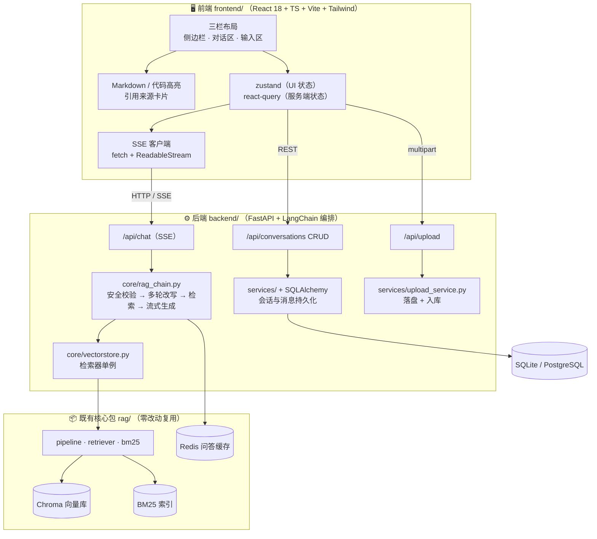
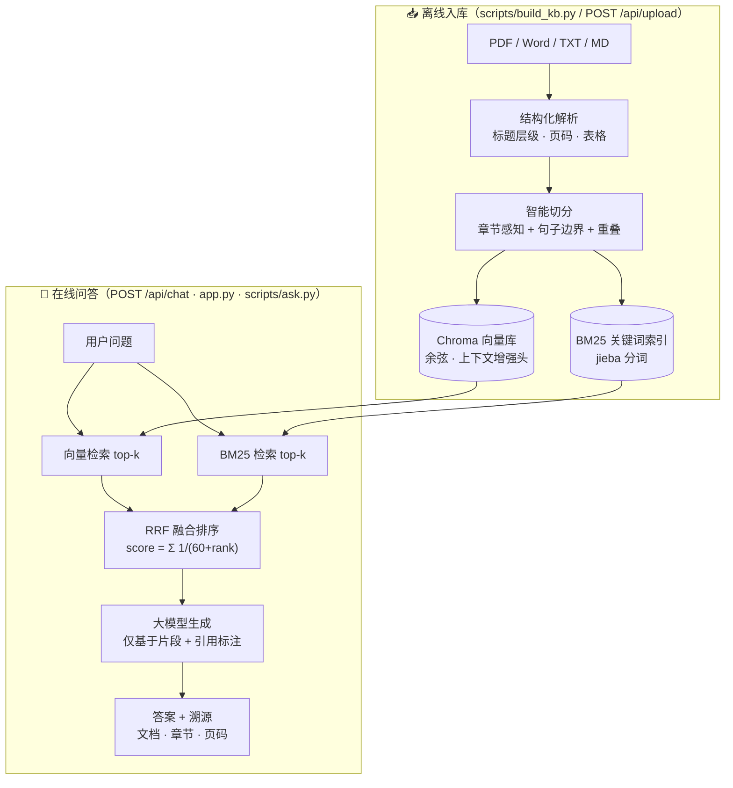
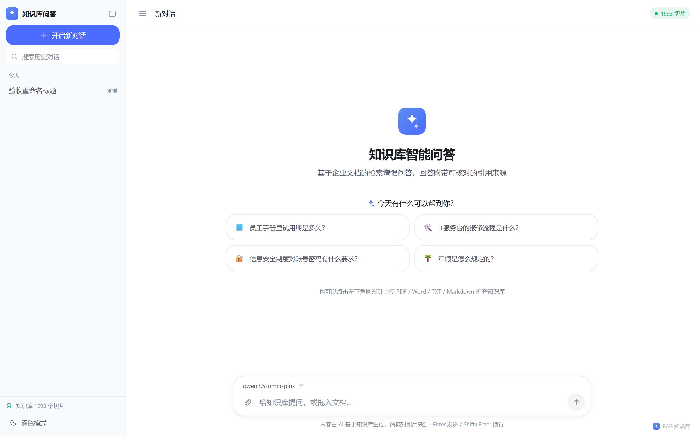
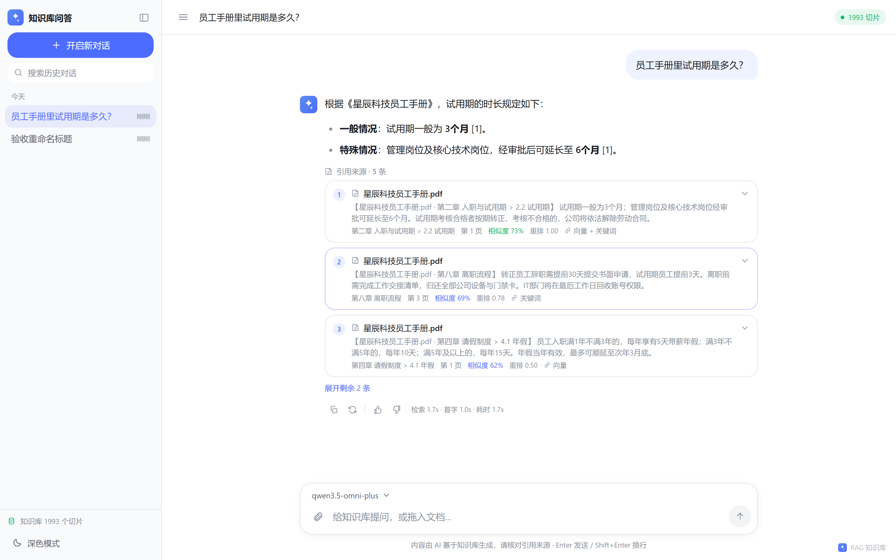
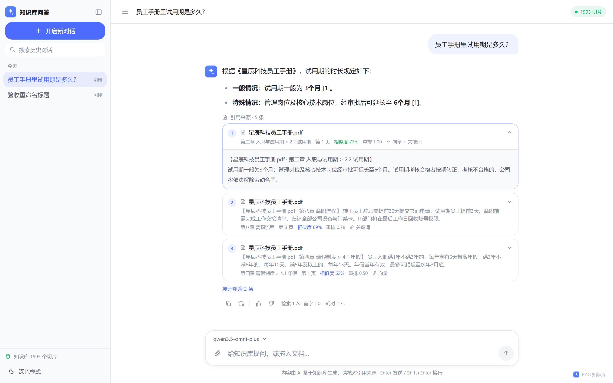
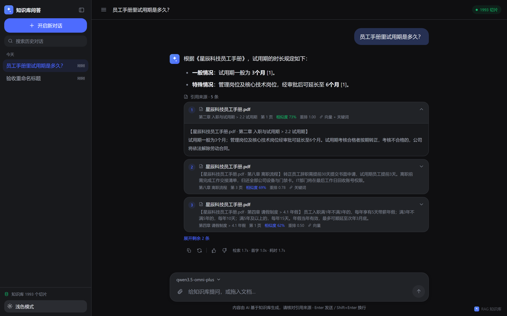
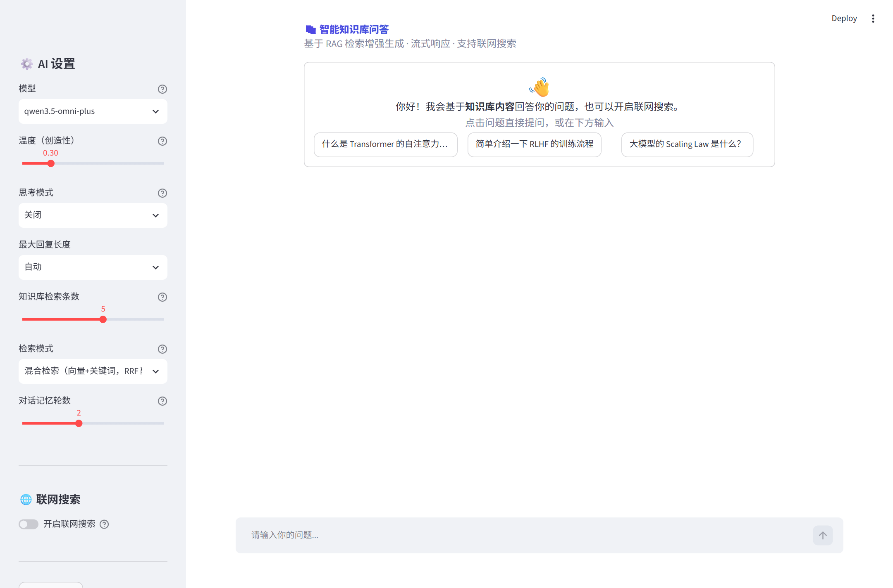
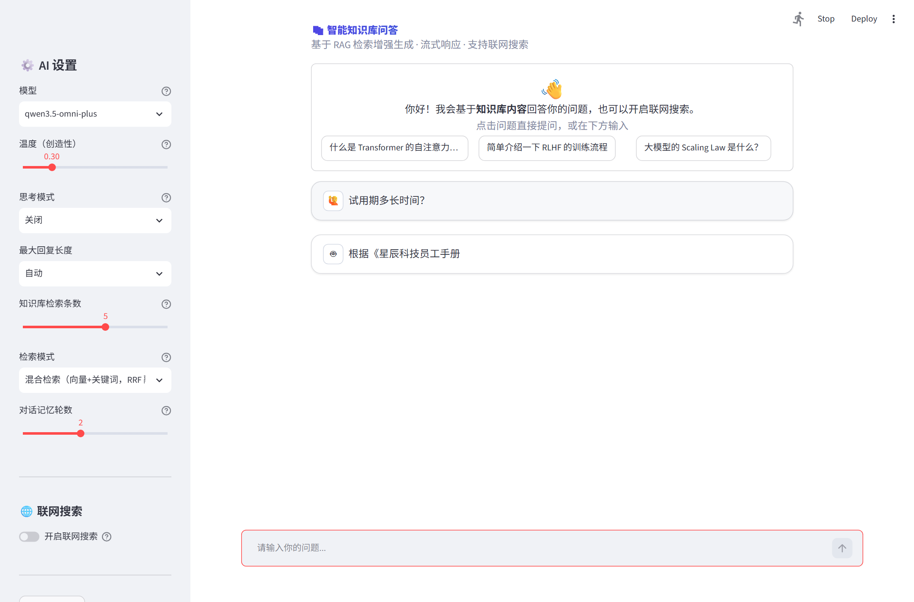
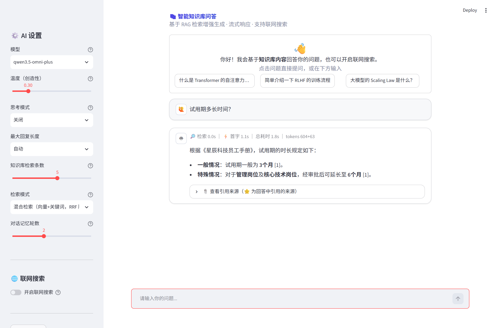
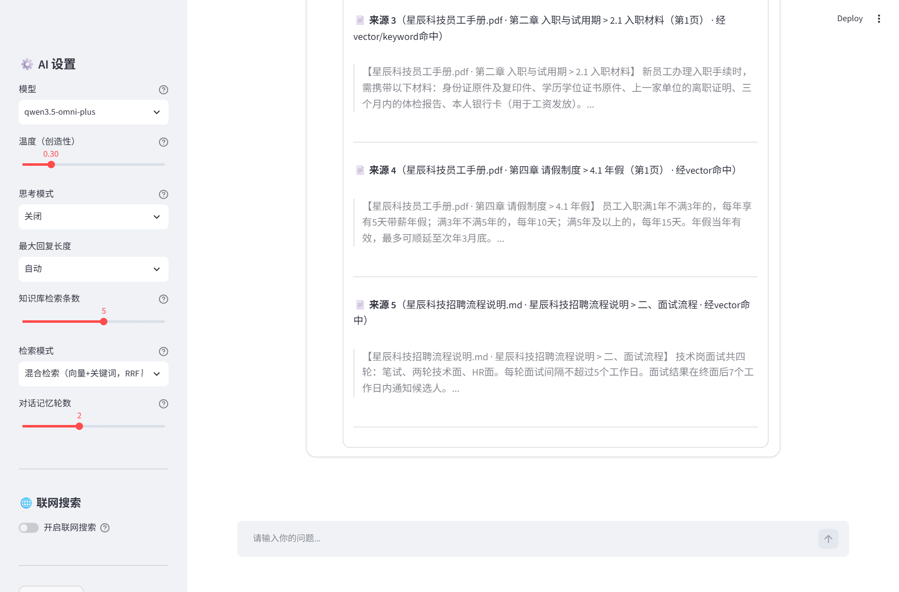

# 企业知识库 RAG 问答系统（带混合检索与答案溯源）

基于 **检索增强生成（RAG）** 的中文企业知识库问答系统：支持 PDF / Word / TXT / Markdown 多格式文档入库，
**结构感知的智能切分**、**向量 + BM25 关键词混合检索（RRF 融合）**、**段落级答案溯源**、**多轮对话查询改写**，
并附带一套 **206 题评测集与可复现的评测框架**（bootstrap 置信区间、忠实度/相关性指标、逐模块消融与显著性检验）——
升级前在 30 题评测上端到端准确率从基线 **84.6% 提升到 96.2%**，升级后评测体系扩展至 22 篇语料 / 206 题
（详见 `eval/results/` 下各报告）。

> 技术栈：Python · Chroma · sentence-transformers(text2vec-base-chinese) · BM25(jieba) · OpenAI 兼容大模型 · **FastAPI（后端）** · **React 18 + TypeScript + Vite + Tailwind（前端）** · **SQLAlchemy + SQLite（会话持久化）** · SSE 流式输出 · **Redis（问答缓存）** · Docker
>
> 🆕 **v3.0 已改造为前后端分离架构**：后端 `backend/`（FastAPI + SSE），前端 `frontend/`（React + TypeScript，界面风格对齐 DeepSeek 官方网页版）。原有的 `rag/` 核心包与 `app.py`（Streamlit）完整保留，三条链路（前端 / CLI / Streamlit）共用同一套检索与生成逻辑。

---

## 1. 项目背景

企业内部沉淀了大量制度、手册、说明书类文档（PDF/Word 散落各处），员工找一个问题的答案往往要翻几十页。
直接把文档丢给大模型又面临三个问题：上下文装不下、答案无出处不可信、模型会编造。

本项目用 RAG 解决：**入库时把文档切成带结构信息的知识块，问答时先检索最相关的几个块，再让大模型只依据这些块作答，
并强制标注每句话来自哪个文档的哪个章节**。为了让检索又准又稳，在常见的"向量检索"之上做了两层增强：
智能切分（而非固定长度切分）和混合检索（关键词 + 语义双路召回）——这两层的贡献都有评测数据支撑（见第 5 节）。

## 2. 核心功能

| 功能 | 说明 |
|---|---|
| 📄 多格式文档解析 | PDF（PyMuPDF，按字体大小识别标题层级，find_tables 结构化提取表格）、Word（python-docx，标题样式与表格）、TXT/Markdown（正则识别章节与 FAQ 问答体） |
| ✂️ 智能切分 | 按标题还原"文档 > 章节"层级，切分不跨章节；段落贪心打包，超长段落按句子边界下切；相邻块保留句子级重叠；**表格按行分组、每组携带表头，跨页表格自动合并** |
| 🔍 混合检索 | 向量语义召回 + BM25 关键词召回（jieba 分词，支持精确/搜索模式与自定义词典），RRF 融合（`score=Σ1/(k+rank)^p`，参数可调），**CrossEncoder 精排（bge-reranker，可开关）**，`RETRIEVAL_MODE` 一键切换 |
| 🧠 大模型生成 | OpenAI 兼容接口（DeepSeek / 通义 / 智谱 / OpenAI 均可），仅基于检索片段作答，强制拒答知识库外问题；表格片段带行列提示、多来源问题逐来源引用 |
| 📎 答案溯源 | 答案中 `[1][2]` 引用标注 ↔ 检索块一一对应，可追溯到 **文档名 · 章节路径 · 页码**；引用编号经校验，伪造编号自动重生成 |
| 💬 多轮对话 | `chat(message, history)` 统一入口；"规则 + LLM"两步式查询改写完成指代消解与省略补全（"那转正后呢？"→ 独立问题） |
| 🛡️ 安全加固 | 提示注入检测与拦截（含日志）、输入长度/控制字符过滤、引用编号校验与自动重生成、全链路审计日志（prompt/检索/答案/引用映射） |
| 📊 效果评测 | 22 篇语料 / **243 题**（单轮 156 + 多轮 16 + **多跳 15** + **同义改写 8** + **对抗错误前提 12** + 拒答 36），五项指标（Recall/MRR/准确率/忠实度/相关性），95% bootstrap 置信区间、按文档类型与题型分项、配对显著性检验、RRF 网格搜索与 BM25 变体消融、Reranker 开关对比 |
| ⚡ 性能与规模化 | MD5 增量入库、多线程解析、ONNX/INT8 嵌入加速对比、1000 篇入库与 P50/P95 延迟基准、Milvus 迁移脚本、**运行指标落库（P50/P95/P99、错误率、Token 消耗，`scripts/metrics_report.py`）与阈值告警** |
| 🛡️ LangChain 使用 | 嵌入层经 `langchain_huggingface.HuggingFaceEmbeddings` 封装加载（失败自动回退 sentence-transformers 直连）；重排序因 langchain-community 0.4.x 移除压缩器组件而直接采用其同源实现 `sentence_transformers.CrossEncoder`——组件选型以可用性与质量为准，不为用而用 |
| 🚀 服务化 API | `api_server.py`：FastAPI 提供 `/ask`、`/ask/stream`(SSE)、`/ingest`、`/health`、`/cache/stats` 等端点，Pydantic 校验请求体，可选 Bearer / X-API-Key 鉴权；与 Streamlit **共用同一套 `rag/` 核心包**，不重复实现任何 RAG 逻辑 |
| ⚡ Redis 问答缓存 | 高频问答对命中即直接返回，跳过检索与生成：实测**冷启动 4.83s → 命中 0.24ms**（本机 Redis，5 题 × 3 轮）。键含 `模式/模型/top_k/KB版本`，**入库自动失效**；Redis 不可用时全部降级为 no-op，不影响可用性 |
| 🐳 容器化部署 | `Dockerfile`（非 root 运行 + HEALTHCHECK + 依赖分层缓存）+ `docker-compose.yml`（redis + api + ui 三服务，模型缓存与向量库持久化到卷） |
| 🔀 异步入库 | `ingest(..., async_parse=True)`：asyncio 事件循环 + `asyncio.to_thread` 并发解析，Semaphore 限流防止提交上千文件打爆内存；**实测解析阶段与线程池持平**（详见 `eval/results/benchmark_parse_concurrency.json`），真正省时的是 MD5 增量跳过 |

## 3. 系统架构

### 3.1 前后端分离总览（v3.0）



### 3.2 RAG 检索链路（v2 起沿用，未改动）



**一次问答的完整链路**：问题分别走向量、关键词两路召回 → RRF 按排名融合（只比排名不比分数量纲）→ 取 top-5 块，
每块以 `[编号] 来源：文档 · 章节（页码）` 形式拼入提示词 → 大模型作答并用 `[编号]` 标注引用 → 前端把编号映射回块的出处。

### 3.3 前后端接口契约

| 方法 | 路径 | 说明 |
|---|---|---|
| `POST` | `/api/chat` | **SSE 流式问答**。请求 `{message, conversation_id, model?, mode?, top_k?, thinking?}`；事件序列 `conversation → sources → status → reasoning* → content* → done` |
| `POST` | `/api/conversations` | 新建会话 → `{conversation_id, title, created_at}` |
| `GET` | `/api/conversations` | 会话列表（按 `updated_at` 倒序）→ `[{conversation_id, title, updated_at, message_count}]` |
| `GET` | `/api/conversations/{id}/messages` | 某会话全部消息 → `[{role, content, sources?, created_at, ...}]` |
| `DELETE` | `/api/conversations/{id}` | 删除会话（消息级联删除） |
| `PUT` | `/api/conversations/{id}/title` | 重命名会话 |
| `POST` | `/api/upload` | 上传文档（PDF / Word / TXT / Markdown）→ `{file_id, filename, status, chunks}` |
| `GET` | `/api/health` | 服务与知识库状态（切片数、模型清单、缓存统计） |

完整 OpenAPI 文档：后端启动后访问 `http://127.0.0.1:8000/docs`。

## 4. 技术选型理由

| 选型 | 备选方案 | 选择理由 |
|---|---|---|
| **Chroma** | FAISS / Milvus / Elasticsearch | 单机嵌入式部署零运维，持久化开箱即用，支持按 metadata 过滤与删除（幂等入库依赖按文档删除）；Milvus 适合更大规模，当前场景过重 |
| **text2vec-base-chinese（本地）** | OpenAI text-embedding-3 / BGE API | 评测与问答零调用成本、可离线复现；中文企业制度类文本效果稳定；模型 100MB 级，CPU 即可实时编码查询 |
| **BM25 + RRF 融合** | 纯向量 / 加权分数融合 | 向量对型号、编号、专有名词等精确匹配不敏感，BM25 恰好补位；RRF 只用排名不比对数分数，免去两路分数归一化的调参 |
| **结构感知切分** | 固定窗口滑动切分 | 制度类文档答案高度集中在"某个小节"，跨章节的固定窗口会切断答案并混入无关章节内容（评测中基线的 3 个检索失败全部源于此）；保留章节路径还让溯源能到段落级 |
| **OpenAI 兼容接口** | 各厂商私有 SDK | 一套代码任意切换 DeepSeek/通义/智谱/OpenAI，项目只耦合协议不耦合厂商 |
| **FastAPI + Streamlit 双形态** | 只做其一 | 两者共用 `rag/` 核心包：FastAPI 用于服务化与系统集成（前端分离、供其他服务调用），Streamlit 用于交互式演示与调参。核心逻辑零 UI 依赖，换壳成本极低 |
| **Redis 缓存问答对** | 进程内 LRU / 不缓存 | 制度类问答的访问高度重复（同一问题被多人反复问）。缓存在 Redis 而非进程内，是为了多 worker/多实例共享命中；入库时按 KB 版本整体失效，避免返回过期答案。**未部署 Redis 时自动降级，不阻塞主流程** |
| **React + TypeScript + Vite（v3.0 前端）** | 继续用 Streamlit / Vue / 服务端渲染 | 前后端分离后前端可独立部署与迭代，交互能力（多轮会话管理、拖拽上传、逐字流式、引用卡片）远超 Streamlit 的表达上限；Vite 冷启动与 HMR 快，TypeScript 让前后端契约在编译期就能对齐 |
| **Tailwind CSS（CSS 变量 + darkMode: class）** | CSS Modules / styled-components | 设计令牌集中在一处 CSS 变量里，深/浅色切换只需给 `<html>` 加减一个 class，全站自动生效；不需要为每个组件维护两套样式 |
| **zustand + react-query 分工** | 全部塞进一个全局 store | 客户端状态（当前会话、侧边栏、主题、流式缓冲）与服务端状态（会话列表、消息历史）刻意分开：前者用 zustand，后者交给 react-query 负责缓存与失效，避免"同一份数据两处维护" |
| **SSE（`text/event-stream`）** | WebSocket | 问答是**单向**的服务端推送，SSE 语义正好匹配；基于普通 HTTP，能直接复用现有网关/反代与鉴权，浏览器断线自动重连，比 WebSocket 少一层连接管理。实测经 Vite 代理后仍是逐 token 到达（见第 9 节） |
| **自管理消息历史 + SQLAlchemy** | LangChain `ConversationBufferMemory` | 对话要在刷新/换设备后完整还原（含引用来源与耗时统计），必须落库；`ConversationBufferMemory` 活不过进程重启且只保留纯文本、会丢掉 sources |
| **Streamlit（保留）** | 直接删除 | 演示与自用仍然顺手：流式渲染、侧边栏调参、文件上传均内置。保留它可证明核心逻辑与 UI 真正解耦（同一份 `rag/` 包同时驱动 React 前端、Streamlit 与 CLI 三条链路） |

## 5. 效果评测

### 5.1 评测设置

- **评测集**：30 题（`eval/questions.jsonl`）——26 道可回答题（金标答案取文档原文片段）+ 4 道知识库未覆盖题（考察拒答能力）；
- **评测文档**：`data/samples` 下 4 篇虚构企业文档（PDF 手册 / Word 说明书含表格 / TXT 制度 / TXT FAQ），覆盖多级标题、表格、问答体等真实结构；
- **指标**：检索看 Recall@k / MRR（答案级：金标片段必须完整出现在召回块中）；回答质量由大模型判分（LLM-as-Judge，三档 correct/partial/wrong）；
- **消融配置**：基线（固定窗口切分 + 纯向量）→ +智能切分 → +混合检索，隔离每一层的贡献。

### 5.2 结果

**检索效果（26 道可回答题）**

| 配置 | Recall@1 | Recall@3 | Recall@5 | MRR |
|---|---|---|---|---|
| 基线：固定窗口切分 + 纯向量检索 | 73.1% | 88.5% | 88.5% | 0.808 |
| 智能切分 + 纯向量检索 | 88.5% | 92.3% | **100.0%** | 0.919 |
| 智能切分 + 混合检索（完整系统） | 84.6% | **100.0%** | **100.0%** | **0.923** |

**端到端回答质量（30 题）**

| 配置 | 准确率(correct) | correct+partial | 引用率 | 溯源准确率 | 拒答正确率 |
|---|---|---|---|---|---|
| 基线：固定窗口切分 + 纯向量检索 | 84.6% | 88.5% | 96.2% | 0.0% | 75% |
| 智能切分 + 纯向量检索 | **96.2%** | **98.1%** | 100.0% | **100.0%** | 100% |
| 智能切分 + 混合检索（完整系统） | **96.2%** | **98.1%** | 100.0% | **100.0%** | 75% |

### 5.3 结论与诚实说明

- **智能切分是最大收益来源**：Recall@5 从 88.5% → 100%，准确率 84.6% → 96.2%（+11.6pp）。基线的 3 个检索失败全部是答案被固定窗口切断或跨章节截断导致；回答侧还观察到基线把《远程办公制度》内容混进《员工手册》问题的失败案例（无章节边界导致跨文档污染）。
- **混合检索在排序质量上收益稳定**：Recall@3 从 92.3% → 100%（向量第 3 名之后才命中的题被关键词路直接顶到前排），MRR 0.919 → 0.923。在本评测集上语义检索已很强，混合检索的增益体现在排序更靠前；对型号/编号类精确查询（如"1350W"）BM25 路提供了语义检索不具备的兜底能力。
- **溯源能力是切分带来的结构性收益**：基线切块没有章节元数据，溯源准确率为 0（只能给文档名），智能切分做到 100% 定位到"文档 · 章节 · 页码"。
- **局限**：拒答正确率基于仅 4 道题，存在波动（75% vs 100% 属于同一模型对 1 道题的判定差异）；LLM-as-Judge 与被测模型为同一模型，存在自判偏差；评测语料规模小（4 篇文档），指标绝对值会高于真实大规模语料场景。

### 5.4 复现评测

```bash
python scripts/make_samples.py # 生成 v1 评测用示例文档（4 篇）
python scripts/run_eval.py --legacy --retrieval-only # v1 30 题回归（检索指标）
python scripts/run_eval.py --legacy # v1 30 题全量评测

# 升级版评测（22 篇语料 / 206 题，含置信区间与消融）
python scripts/make_corpus.py # 生成语料与评测集
python scripts/run_eval.py # 四配置全量评测（五项指标 + CI）
python scripts/run_eval.py --retrieval-only # 仅检索指标（无需 API Key）
python scripts/tune_retrieval.py # RRF 网格搜索 / BM25 变体 / 查询扩展
python scripts/benchmark_scale.py # 1000 篇入库与延迟基准
python scripts/benchmark_embedding.py # PyTorch vs ONNX fp32/int8
# 结果输出至 eval/results/（report_v2.md / tuning.md / benchmark_*.md）
```

## 6. 快速开始

> 📖 更详细的图文教程（含界面导览、多模型配置、常见问题）见 [USAGE.md](USAGE.md)。

```bash
# 1. 安装依赖（建议 Python 3.10+）
pip install -r requirements.txt

# 2. 配置密钥：复制模板，填入任意 OpenAI 兼容服务的 Key（见 .env.example 内的厂商示例）
copy .env.example .env # Windows（Linux/Mac 用 cp）

# 3. 生成示例文档并入库（PDF/Word/TXT 各一套）
python scripts/make_samples.py
python scripts/build_kb.py # 默认入库 data/samples，写入 chroma_db

# 4. 命令行问答（带答案溯源）
python scripts/ask.py "试用期多长时间？"
python scripts/ask.py "咖啡机保修几年" --mode vector # 对比纯向量检索效果
```

### 6.1 前后端分离模式（v3.0，推荐）

需要开**两个终端**：

```bash
# 终端 1：后端（FastAPI + SSE），监听 8000
uvicorn backend.main:app --reload --port 8000
#   OpenAPI 文档： http://127.0.0.1:8000/docs
#   健康检查：     http://127.0.0.1:8000/api/health

# 终端 2：前端（Vite 开发服务器），监听 5173
cd frontend
npm install          # 首次需执行
npm run dev
#   浏览器打开：   http://127.0.0.1:5173
```

前端开发服务器已把 `/api` 反向代理到后端（配置见 `frontend/vite.config.ts`），
因此**开发态同源、无需处理 CORS**；生产构建产物用 Nginx 同源反代即可。

```bash
# 生产构建
cd frontend && npm run build      # 产物在 frontend/dist/
```

> 前端如何知道后端地址：默认走相对路径 `/api`，由 Vite 代理（开发）或 Nginx（生产）转发。
> 如需前端直连后端（跨域），在前端环境变量里设置 `VITE_API_BASE`，
> 并把前端地址加入后端 `CORS_ORIGINS`。

### 6.2 容器化一键起服务（前后端分离）

```bash
docker compose up -d --build          # 起 redis + api + web
#   前端：   http://127.0.0.1:8080
#   后端：   http://127.0.0.1:8000/docs

docker compose logs -f api            # 看后端日志
docker compose down                   # 停止
```

服务拓扑：`web(nginx :8080)` ──`/api/*`──▶ `api(FastAPI :8000)` ──▶ `redis`；
向量库、会话库、上传文件、模型缓存都挂载到宿主机卷，容器重建不丢数据。

nginx 已针对 SSE 关掉 `proxy_buffering`（见 `frontend/nginx.conf`）——
不关的话流式输出会被攒成一坨再一次性吐出，打字机效果就没了。

```bash
# 额外起 Streamlit 演示界面（可选，默认不启动）
docker compose --profile legacy up -d
```

### 6.3 其他入口（保留，未删除）

```bash
# Streamlit 演示界面（与后端共用同一份 rag/ 核心包与向量库）
streamlit run app.py

# 旧版服务化 API（/ask、/ask/stream、/ingest）
uvicorn api_server:app --host 0.0.0.0 --port 8000

# Docker 配置静态校验（compose 语法 / 引用 / 挂载路径 / 指令）
python scripts/check_docker_config.py
```

### 6.4 自检脚本

```bash
python scripts/check_backend.py        # 后端：配置/建表/CRUD/路由契约（离线，不需要 API Key）
python scripts/verify_backend_e2e.py   # 后端端到端：会话 CRUD + 上传 + SSE 流式 + 持久化
python scripts/verify_frontend.py      # 前端验收：Playwright 走一遍真实交互并断言（27 项）
python scripts/capture_frontend.py     # 生成界面截图到 screenshots/frontend/
python scripts/check_docker_config.py  # Docker 配置静态校验
```

## Redis 问答缓存（可选但推荐）

制度类知识库的访问高度重复，缓存高频问答对可以把「检索 + 生成」整段省掉：

```bash
# 本机启动 Redis
docker run -d -p 6379:6379 redis:7-alpine
# 或 Windows 本地：redis-server
```

在 `.env` 中配置（默认值已可用）：

```ini
REDIS_URL=redis://127.0.0.1:6379/0
CACHE_ENABLED=auto # auto：连得上就启用 | on：必须启用 | off：关闭
CACHE_TTL=1800 # 秒
```

**实测收益**（`scripts/benchmark_cache.py`，本机 Redis + 真实大模型，5 题 × 3 轮）：

| 口径 | 平均延迟 | P50 | P95 |
|---|---|---|---|
| 冷启动（未命中，走完整链路） | 4826.6 ms | 4642.7 ms | 7096.4 ms |
| **缓存命中（直接返回）** | **0.24 ms** | 0.19 ms | 0.39 ms |
| 无缓存基线（同题全链路） | 5054.3 ms | 4386.0 ms | 9162.4 ms |

- 命中相对冷启动 **≈20000×**（4.83s → 0.24ms）；
- 在 50% 命中率的混合流量下，整体延迟降低约 **52%**；
- **收益大小取决于访问重复率**——命中省掉的是 LLM 生成（约 4.5s）与检索（约 50ms），
  首次提问或长尾问题仍需走完整链路，因此不能把"命中延迟"当成"平均延迟"。

失效机制：缓存键包含知识库版本号，`ingest()` 成功后版本 +1 并清理旧命名空间，
保证**入库后不会返回过期答案**。Redis 不可用时 `rag/cache.py` 全部方法降级为 no-op。

## 异步入库与并发模型（实测结论）

`ingest()` 的解析阶段支持 asyncio + 线程池并发（`ASYNC_INGEST=1`，默认开启），
用 Semaphore 限制并发度。三份基准脚本分别测量不同层面：

```bash
python scripts/benchmark_parse_concurrency.py --dir data/corpus # 纯解析阶段
python scripts/benchmark_async_ingest.py --dir data/corpus # 完整入库
```

**诚实的实测结论**（见 `eval/results/`）：

- 在 **22 篇制度文档**上：解析阶段串行 0.36s / 线程池 0.32s / asyncio 0.33s，
  差异约 10%，但**解析只占入库总耗时 13.4s 的 2.5%**，总耗时差异 <1%
  （瓶颈是嵌入向量化，它是批处理且不随并发模型变化）；
- 在 4.91MB 放大的文档上解析耗时拉到 0.42s，三者仍在噪声范围内；
- 根因：`parsers.py` 的切分与后处理是**纯 Python CPU 计算**，受 GIL 限制，
  并发只能重叠阻塞式 IO，无法并行 CPU。

因此并发解析的价值在于**代码结构更清晰、限流可控**，而不是数量级提速；
真正省时间的是 **MD5 增量入库**（1000 篇重跑仅 1.25s）。这一点如实记录，不做夸大。

**用自己的文档**：`python scripts/build_kb.py D:\你的文档目录`（支持文件或目录，自动按扩展名解析；
同一文档重复入库自动覆盖旧块）。

### 多模型 / 多厂商配置

单端点多模型：`.env` 里一行清单即可（Web 界面下拉切换）：

```ini
MODEL_OPTIONS=qwen3.5-omni-plus,deepseek-v3.1,qwen-flash
```

多厂商混用：在 `.env` 中按"别名"追加端点，模型名用 `@` 指向所属端点：

```ini
ALIYUN__BASE_URL=https://dashscope.aliyuncs.com/compatible-mode/v1
ALIYUN__API_KEY=sk-xxx
DEEPSEEK__BASE_URL=https://api.deepseek.com
DEEPSEEK__API_KEY=sk-yyy
MODEL_OPTIONS=qwen-plus@aliyun,deepseek-chat@deepseek,glm-4-flash@zhipu
```

客户端按 `(base_url, api_key)` 缓存路由，Web 下拉框、CLI（`--model "deepseek-chat@deepseek"`）、
评测判分（`JUDGE_MODEL=xxx@alias`）全链路生效；完整示例见 `.env.example`。

## 7. 系统运行截图

### 7.1 新版前端（React · 界面风格对齐 DeepSeek 网页版）

> 截图由 `scripts/capture_frontend.py` 用 Playwright 自动操作真实页面生成
> （非手绘/非设计稿）：打开 `npm run dev` 的页面 → 点击推荐问题 → 等待流式生成完成 → 截图。
> 复现：`python scripts/capture_frontend.py`（需先 `pip install playwright && playwright install chromium`）。

**空状态**：居中 Logo + 欢迎语 + 可点击的推荐问题卡片，左侧为会话列表（按今天/昨天/近7天/更早分组）。



**问答态**：用户消息右对齐浅蓝气泡，AI 回答左对齐无底色；回答中的 `[1]` 编号与下方引用卡片一一对应。



**引用来源卡片**：显示文档名、章节路径、页码、相似度、重排分数与命中路径（向量/关键词），点击展开原文片段。



**深色模式**：主题切换全局生效（CSS 变量 + Tailwind `darkMode: 'class'`），并持久化到 localStorage。



**移动端**：侧边栏收起为抽屉，点击汉堡菜单滑出（响应式断点 768px）。


### 7.2 Streamlit 演示界面（保留）

> 截图由 `scripts/capture_screenshots.py` 自动生成。
> 复现：`python scripts/capture_screenshots.py`。

**主界面**：左侧为 AI 设置（模型 / 温度 / 思考模式 / 检索条数 / 检索模式 / 对话记忆轮数 / 联网搜索 / 文档入库），
右侧为对话区，空状态给出可点击的示例问题。



**运行过程（检索 + 流式生成）**：提问后先做安全检查与查询改写，再执行混合检索，最后流式生成答案。



**运行结果（答案 + 答案溯源）**：答案中的 `[1]` 等编号与检索块一一对应，底部给出检索/首字/总耗时与 token 消耗。



展开「查看引用来源」后，可看到每个命中块的 **文档名 · 章节路径 · 页码**、命中的检索路径
（vector / keyword，即混合检索里是哪一路召回的）以及命中的原文片段。



## 8. 项目结构

```
rag/
├── backend/ # 🆕 v3.0 后端服务（FastAPI + SSE + 会话持久化）
│   ├── main.py #   FastAPI 入口：CORS / 路由注册 / lifespan 预热
│   ├── config.py #   Pydantic Settings（新增配置；密钥复用 rag/config.py 的 .env 契约）
│   ├── api/
│   │   ├── chat.py #   POST /api/chat：SSE 事件生成与落库
│   │   ├── conversations.py #   会话 CRUD 五个端点
│   │   └── upload.py #   POST /api/upload：文档上传入库
│   ├── core/
│   │   ├── rag_chain.py #   RAG 编排：安全校验→改写→检索→流式生成，产出结构化事件
│   │   ├── streaming.py #   流式封装（等价于旧 app.py::stream_answer，含参数降级重试）
│   │   ├── vectorstore.py #   检索器进程级单例（入库后热重载）
│   │   └── embeddings.py #   Embedding 配置元信息（模型本身未改动）
│   ├── models/ #   SQLAlchemy：database / conversation / message
│   ├── schemas/ #   Pydantic：chat / conversation / common / upload
│   ├── services/ #   业务层：conversation_service（持久化）/ upload_service（上传入库）
│   ├── uploads/ #   上传文件落盘目录（已 gitignore）
│   └── data/ #    SQLite 会话库（已 gitignore）
├── frontend/ # 🆕 v3.0 前端（React 18 + TypeScript + Vite + Tailwind）
│   ├── src/
│   │   ├── components/
│   │   │   ├── Sidebar.tsx #   侧边栏：新对话/搜索/分组历史/悬停改名删除/主题切换
│   │   │   ├── ChatArea.tsx #   对话区：空状态欢迎页 + 推荐问题 + 消息列表 + 自动滚动
│   │   │   ├── MessageBubble.tsx #   消息气泡：Markdown/思考过程/操作栏（复制·重生成·赞踩）
│   │   │   ├── MarkdownRenderer.tsx #   GFM 渲染 + 代码高亮 + 一键复制
│   │   │   ├── SourceCards.tsx #   引用来源卡片（可折叠，显示原文与相似度）
│   │   │   ├── InputBox.tsx #   输入区：多行输入/拖拽上传/发送·停止/模型选择
│   │   │   └── Icons.tsx #   内联 SVG 图标集
│   │   ├── hooks/ #   useChat（SSE 编排）/ useCopy
│   │   ├── lib/ #   api.ts（REST）/ sse.ts（流式解析）/ date.ts
│   │   ├── store/ #   zustand：会话/侧边栏/主题/草稿/流式缓冲
│   │   ├── types/ #   与后端契约一一对应的 TS 类型
│   │   └── styles/index.css #   设计令牌（CSS 变量）与 Markdown 排版
│   ├── tailwind.config.js #   品牌色 #4D6BFE + 语义化色板（映射 CSS 变量）
│   └── vite.config.ts #   /api 反向代理（开发态同源）
├── app.py # Streamlit 演示界面（保留）
├── api_server.py # 旧版 FastAPI 入口（保留，/ask、/ask/stream、/ingest、/health）
├── Dockerfile # 生产镜像（非 root + HEALTHCHECK + 依赖分层）
├── docker-compose.yml # redis + api + ui 三服务编排
├── rag/ # 核心包（与 UI 解耦，前后端共用，v3.0 未改动）
│   ├── parsers.py #   PDF/Word/TXT/MD → 结构化 Block（标题层级/页码/结构化表格）
│   ├── chunking.py #   智能切分（章节感知+句子边界+重叠+表格分组）与朴素切分基线
│   ├── embeddings.py #   本地句向量模型（CPU/CUDA 自适应）
│   ├── vector_store.py #   Chroma 封装（幂等入库/查询/导出）
│   ├── bm25.py #   BM25 索引（jieba 分词 4 种变体 + 自定义词典，持久化）
│   ├── retriever.py #   统一检索入口：vector / keyword / hybrid(RRF, k/p 可调)
│   ├── cache.py #   Redis 问答缓存（KB 版本失效 + 不可用时优雅降级）
│   ├── rewrite.py #   多轮查询改写（规则 + LLM 两步式）
│   ├── security.py #   注入拦截/输入过滤/引用校验/审计日志
│   ├── stats.py #   bootstrap 置信区间与配对显著性检验
│   ├── llm.py #   带引用的答案生成 + 五维评测判分（judge/忠实度/相关性）
│   ├── pipeline.py #   异步入库（MD5 增量）与 chat/ask 编排
│   └── config.py #   全部配置（.env 驱动）
├── scripts/
│   ├── build_kb.py # 入库 CLI（支持指定目录、重建、朴素切分开关）
│   ├── ask.py # 问答 CLI（多轮交互、来源与命中路径展示）
│   ├── check_backend.py # 后端离线自检（配置/建表/CRUD/路由契约）
│   ├── verify_backend_e2e.py # 后端端到端验证（会话+上传+SSE+持久化）
│   ├── verify_frontend.py # 前端验收（Playwright 真实交互断言）
│   ├── capture_frontend.py # 前端界面截图（README 截图来源）
│   ├── repair_hash_corruption.py # 修复历史脱敏事故导致的 "#" 丢失（见第 12 节）
│   ├── make_samples.py # 生成 v1 评测示例文档（4 篇）
│   ├── make_corpus.py # 生成升级版语料（22 篇）与评测集
│   ├── run_eval.py # 评测 v2：四配置消融 + 五项指标 + bootstrap CI + 显著性
│   ├── tune_retrieval.py # RRF 网格搜索 / BM25 变体对比 / 查询扩展实验
│   ├── benchmark_cache.py # Redis 问答缓存收益基准（冷/热/无缓存三口径）
│   ├── benchmark_parse_concurrency.py # 解析阶段并发模型对比（串行/线程/asyncio）
│   ├── benchmark_async_ingest.py # 完整入库并发对比
│   ├── check_docker_config.py # Docker 配置静态校验（compose 语法/引用/指令）
│   ├── verify_api_e2e.py # 旧版 API 端到端验证（上传入库→缓存失效→新文档可检索）
│   ├── benchmark_scale.py # 1000 篇入库/增量/延迟/内存基准
│   ├── benchmark_embedding.py # PyTorch vs ONNX fp32/int8 编码加速对比
│   ├── capture_screenshots.py # Playwright 自动操作 Streamlit 界面并截图
│   └── migrate_to_milvus.py # Chroma → Milvus 迁移脚本（10 万块级方案）
├── eval/
│   ├── questions.jsonl # v1 评测集（30 题）
│   ├── questions_v2.jsonl # 升级版评测集（206 题：156 单轮 + 16 多轮 + 34 拒答）
│   └── results/ # 全部评测报告与明细（已提交，可直接查看）
├── data/
│   ├── samples/ # v1 示例文档
│   ├── corpus/ # 升级版语料（22 篇：制度/合同/说明书/表格/FAQ/技术文档）
│   └── user_dict.txt # jieba 自定义词典（型号/缩写/术语）
├── screenshots/
│   ├── frontend/ # 🆕 新前端界面截图（capture_frontend.py 生成）
│   └── *.png # Streamlit 界面截图（capture_screenshots.py 生成）
└── tests/ # 50 个单元测试（解析/切分/表格/BM25/改写/安全/统计/缓存/并发）
```

## 9. 关键实现细节

- **智能切分**（`rag/chunking.py`）：标题块驱动章节树，切分不跨章节；章节内按段落贪心装填到 `CHUNK_SIZE`（默认 420 字），超长段落按正则句子边界（`。！？!?；;` 及英文句号）下切；相邻块保留 1 句重叠。向量入库时给每块拼接 `【文档名 · 章节路径】` 上下文头，让"考勤制度里的工作时间"这类查询在向量空间里更可分。
- **RRF 融合**（`rag/retriever.py`）：`score(d) = Σ 1/(60 + rank路(d))`，只用排名不比对原始分，避免余弦距离与 BM25 分数量纲不可比的问题；某一路空结果（如纯英文查询在 BM25 无命中）自动回退另一路。
- **答案溯源**（`rag/llm.py` + `backend/core/rag_chain.py`）：提示词要求关键结论后标注 `[编号]`；后端正则解析引用编号，映射回块的 `文档名/章节路径/页码` 元数据；前端渲染成可折叠的来源卡片，CLI 显示每块的命中路径（vector/keyword）。
- **评测的可靠性**：金标答案一律取文档**原文片段**（按"；"拆成多段，要求同一召回块全部包含），避免"标准答案改写导致误判"；拒答题也走真实检索，让模型面对"看似相关实则无关"的片段做判断。

### 9.1 前后端分离的关键实现（v3.0）

- **SSE 事件协议**：`POST /api/chat` 依次推送 `conversation → sources → status → reasoning* → content* → done`，
  每帧是 `event: <name>` + **单行 JSON** 的 `data:`（多行 JSON 会被前端按行拼接出错）。
  来源先于正文下发，因此前端可以在第一个 token 到达前就把引用卡片渲染出来。
- **浏览器端 SSE 解析**（`frontend/src/lib/sse.ts`）：原生 `EventSource` 只支持 GET，无法带请求体，
  所以用 `fetch` + `ReadableStream` 手工切帧（兼容 `\r\n\r\n`），并用 `AbortController` 实现"停止生成"。
- **同步 IO 不阻塞事件循环**：检索（嵌入 + Chroma + BM25 + 重排）与生成都是阻塞调用，
  统一用 `asyncio.to_thread` 丢进线程池；流式生成则在线程里消费同步迭代器，
  再通过 `loop.call_soon_threadsafe` 把事件投回事件循环（`backend/core/rag_chain.py`）。
- **停止生成也会落库**：客户端 abort 触发 `asyncio.CancelledError`，后端把**已生成的部分回答**保存后再退出，
  因此刷新页面能看到"被中止的回答"，而不是凭空消失。
- **逐 token 流式已验证**：实测同一问题直连后端与经 Vite 代理，均为 7 帧、首末帧间隔约 0.55s
  （若代理缓冲，所有帧会在同一时刻到达），说明代理层没有把流攒成一坨。
- **主题全局生效**：设计令牌集中在 `frontend/src/styles/index.css` 的 CSS 变量里，
  `tailwind.config.js` 把语义色（`bg-canvas` / `text-ink` / `border-line` …）映射到这些变量，
  切换主题只是给 `<html>` 加减 `dark` 类；`index.html` 内联脚本在首帧前读取 localStorage，
  消除深色模式下的白屏闪烁。
- **文件名消毒与大小限流**（`backend/services/upload_service.py`）：只取 `Path(name).name` 防路径穿越，
  扩展名走 `rag.parsers.SUPPORTED_EXTS` 白名单，落盘时边写边计数、超限立即中断并删除半成品。
- **multipart 上传的坑**：前端 `fetch` 绝不能手动设置 `Content-Type`，
  必须让浏览器自己带上 `multipart/form-data; boundary=...`；少了 boundary，FastAPI 会按 JSON 解析并回
  `422 {"loc":["body","file"],"msg":"Field required"}`。这条已在 `frontend/src/lib/api.ts` 里注明。

## 10. API Key 安全与脱敏

### 10.1 脱敏现状（v3.0 已复核）

- Key 只存放在 `.env`（已被 `.gitignore` 排除，**不在** git 历史中），代码一律通过 `os.getenv` 读取；
- 仓库提供 `.env.example` 与 `frontend/.env.example` 模板，只含占位符，不含任何真实密钥、真实端点或个人信息；
- 后端新增配置同样走环境变量：`DATABASE_URL` / `UPLOAD_DIR` / `CORS_ORIGINS`（见 `backend/config.py`），
  大模型与向量库配置**复用** `rag/config.py` 已有的 `.env` 契约，不重复定义、也不新增密钥落地点；
- `chroma_db/`、`*.pkl`、`backend/data/`（SQLite 会话库）、`backend/uploads/`、`frontend/dist/`、`node_modules/`
  等运行产物一律不入库；
- 全历史审计：`python scripts/audit_secrets.py`（CI 已接入 `.github/workflows/secret-scan.yml`，
  每次 push/PR 扫描全部历史），覆盖 `sk-` 密钥、Bearer Token、私有推理端点、内网 IP/域名、手机号、身份证号、邮箱等；
- ⚠️ 若曾把 Key 写进过代码或聊天记录，请立即到服务商控制台**吊销并换新 Key**——提交进 git 历史的密钥即使删除文件也能被翻出。

### 10.2 关于历史提交中的注释损坏（已修复）

仓库中曾有过一次**失败的脱敏操作**：它把代码里所有 `#` 字符替换成了字面量占位标记，
其中连续的多个 `#`（Markdown 的 `##` / `###`）被折叠成一个标记。后果是**所有 Python 文件的注释变成非法语法**，
`import rag.pipeline` 直接 `SyntaxError`，整个项目无法运行（`.gitignore` 注释行、`requirements.txt`、
`docker-compose.yml`、Markdown 标题也一并损坏，共 70 个文件）。

修复方式见 `scripts/repair_hash_corruption.py`：
- 代码/配置文件里 `#` 恒为注释符，标记 → `#` 是唯一且必然正确的还原，并保留 `# noqa` 等工具指令；
- Markdown 行首的标记按标题还原，层级用「不跳级、不回退」规则推断（代码块内与表格内的标记按行内代码还原）。

修复后已验证：`python -m compileall` 全通过、`pytest tests` **50 项全通过**、后端自检与端到端验证全通过。

> 复盘：脱敏应当**只针对密钥值与私有端点**做定向替换，绝不能对代码做全局字符替换。
> 本项目现在用 `scripts/audit_secrets.py` 做**检测与报告**（退出码非 0 让 CI 失败），
> 而不是自动改写源码——检测与改写分离，才不会再发生这类事故。

## 11. Roadmap

- [x] 表格结构化解析（表头携带切分、跨页合并）与表格专项评测题
- [x] 多轮对话与查询改写（规则 + LLM）
- [x] 忠实度 / 答案相关性指标（RAGAS 式，LLM 实现）
- [x] 提示注入防御、引用校验与审计日志
- [x] MD5 增量入库、ONNX/INT8 加速、Milvus 迁移脚本
- [x] 重排序（bge-reranker 或 LLM Listwise Rerank）作为混合检索后的第三层
- [x] FastAPI 服务化（`api_server.py`）+ Docker 容器化（Dockerfile / compose）
- [x] Redis 问答缓存（KB 版本失效 + 不可用时优雅降级）
- [x] **前后端分离重构**：FastAPI + SSE 后端（`backend/`）+ React/TS/Tailwind 前端（`frontend/`），
      会话与消息落库（SQLAlchemy + SQLite/PostgreSQL），界面风格对齐 DeepSeek 网页版
- [ ] 评测扩展：接入 RAGAS 官方实现做交叉校验
- [ ] Chroma 多集合分片的自动化路由
- [ ] 缓存预热与命中率监控看板（当前只有 /cache/stats 计数）
- [ ] 前端：多会话并行流式、消息编辑后重问、回答导出（Markdown/PDF）

## License

[MIT](LICENSE)
