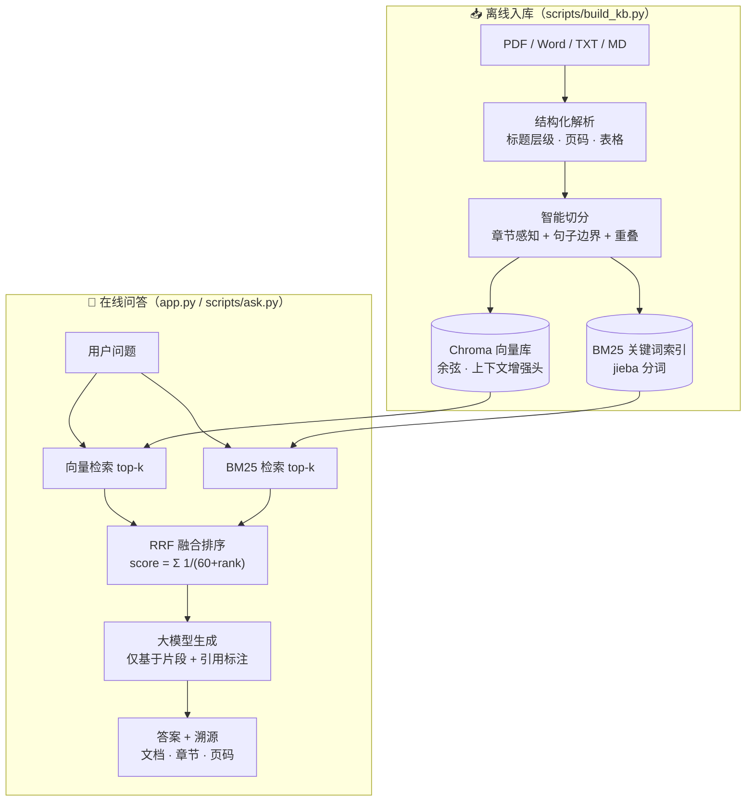

***REMOVED*** 企业知识库 RAG 问答系统（带混合检索与答案溯源）

基于 **检索增强生成（RAG）** 的中文企业知识库问答系统：支持 PDF / Word / TXT / Markdown 多格式文档入库，
**结构感知的智能切分**、**向量 + BM25 关键词混合检索（RRF 融合）**、**段落级答案溯源**、**多轮对话查询改写**，
并附带一套 **206 题评测集与可复现的评测框架**（bootstrap 置信区间、忠实度/相关性指标、逐模块消融与显著性检验）——
升级前在 30 题评测上端到端准确率从基线 **84.6% 提升到 96.2%**，升级后评测体系扩展至 22 篇语料 / 206 题
（详见 `eval/results/` 下各报告）。

> 技术栈：Python · Chroma · sentence-transformers(text2vec-base-chinese) · BM25(jieba) · OpenAI 兼容大模型 · Streamlit

---

***REMOVED******REMOVED*** 1. 项目背景

企业内部沉淀了大量制度、手册、说明书类文档（PDF/Word 散落各处），员工找一个问题的答案往往要翻几十页。
直接把文档丢给大模型又面临三个问题：上下文装不下、答案无出处不可信、模型会编造。

本项目用 RAG 解决：**入库时把文档切成带结构信息的知识块，问答时先检索最相关的几个块，再让大模型只依据这些块作答，
并强制标注每句话来自哪个文档的哪个章节**。为了让检索又准又稳，在常见的"向量检索"之上做了两层增强：
智能切分（而非固定长度切分）和混合检索（关键词 + 语义双路召回）——这两层的贡献都有评测数据支撑（见第 5 节）。

***REMOVED******REMOVED*** 2. 核心功能

| 功能 | 说明 |
|---|---|
| 📄 多格式文档解析 | PDF（PyMuPDF，按字体大小识别标题层级，find_tables 结构化提取表格）、Word（python-docx，标题样式与表格）、TXT/Markdown（正则识别章节与 FAQ 问答体） |
| ✂️ 智能切分 | 按标题还原"文档 > 章节"层级，切分不跨章节；段落贪心打包，超长段落按句子边界下切；相邻块保留句子级重叠；**表格按行分组、每组携带表头，跨页表格自动合并** |
| 🔍 混合检索 | 向量语义召回 + BM25 关键词召回（jieba 分词，支持精确/搜索模式与自定义词典），RRF 融合（`score=Σ1/(k+rank)^p`，参数可调），`RETRIEVAL_MODE` 一键切换 |
| 🧠 大模型生成 | OpenAI 兼容接口（DeepSeek / 通义 / 智谱 / OpenAI 均可），仅基于检索片段作答，强制拒答知识库外问题 |
| 📎 答案溯源 | 答案中 `[1][2]` 引用标注 ↔ 检索块一一对应，可追溯到 **文档名 · 章节路径 · 页码**；引用编号经校验，伪造编号自动重生成 |
| 💬 多轮对话 | `chat(message, history)` 统一入口；"规则 + LLM"两步式查询改写完成指代消解与省略补全（"那转正后呢？"→ 独立问题） |
| 🛡️ 安全加固 | 提示注入检测与拦截（含日志）、输入长度/控制字符过滤、引用编号校验与自动重生成、全链路审计日志（prompt/检索/答案/引用映射） |
| 📊 效果评测 | 22 篇语料 / 206 题评测集（拒答题 16.5%、16 道多轮指代题），五项指标（Recall/MRR/准确率/忠实度/相关性），95% bootstrap 置信区间、分文档类型分项、配对显著性检验、RRF 网格搜索与 BM25 变体消融 |
| ⚡ 性能与规模化 | MD5 增量入库、多线程解析、ONNX/INT8 嵌入加速对比、1000 篇入库与 P50/P95 延迟基准、Milvus 迁移脚本 |

***REMOVED******REMOVED*** 3. 系统架构



**一次问答的完整链路**：问题分别走向量、关键词两路召回 → RRF 按排名融合（只比排名不比分数量纲）→ 取 top-5 块，
每块以 `[编号] 来源：文档 · 章节（页码）` 形式拼入提示词 → 大模型作答并用 `[编号]` 标注引用 → 前端把编号映射回块的出处。

***REMOVED******REMOVED*** 4. 技术选型理由

| 选型 | 备选方案 | 选择理由 |
|---|---|---|
| **Chroma** | FAISS / Milvus / Elasticsearch | 单机嵌入式部署零运维，持久化开箱即用，支持按 metadata 过滤与删除（幂等入库依赖按文档删除）；Milvus 适合更大规模，当前场景过重 |
| **text2vec-base-chinese（本地）** | OpenAI text-embedding-3 / BGE API | 评测与问答零调用成本、可离线复现；中文企业制度类文本效果稳定；模型 100MB 级，CPU 即可实时编码查询 |
| **BM25 + RRF 融合** | 纯向量 / 加权分数融合 | 向量对型号、编号、专有名词等精确匹配不敏感，BM25 恰好补位；RRF 只用排名不比对数分数，免去两路分数归一化的调参 |
| **结构感知切分** | 固定窗口滑动切分 | 制度类文档答案高度集中在"某个小节"，跨章节的固定窗口会切断答案并混入无关章节内容（评测中基线的 3 个检索失败全部源于此）；保留章节路径还让溯源能到段落级 |
| **OpenAI 兼容接口** | 各厂商私有 SDK | 一套代码任意切换 DeepSeek/通义/智谱/OpenAI，项目只耦合协议不耦合厂商 |
| **Streamlit** | FastAPI + 前端 / Gradio | 演示与自用优先：流式渲染、侧边栏调参、文件上传均内置；核心逻辑全部在 `rag/` 包中，与 UI 解耦，迁移到 FastAPI 只需换壳 |

***REMOVED******REMOVED*** 5. 效果评测

***REMOVED******REMOVED******REMOVED*** 5.1 评测设置

- **评测集**：30 题（`eval/questions.jsonl`）——26 道可回答题（金标答案取文档原文片段）+ 4 道知识库未覆盖题（考察拒答能力）；
- **评测文档**：`data/samples` 下 4 篇虚构企业文档（PDF 手册 / Word 说明书含表格 / TXT 制度 / TXT FAQ），覆盖多级标题、表格、问答体等真实结构；
- **指标**：检索看 Recall@k / MRR（答案级：金标片段必须完整出现在召回块中）；回答质量由大模型判分（LLM-as-Judge，三档 correct/partial/wrong）；
- **消融配置**：基线（固定窗口切分 + 纯向量）→ +智能切分 → +混合检索，隔离每一层的贡献。

***REMOVED******REMOVED******REMOVED*** 5.2 结果

**检索效果（26 道可回答题）**

| 配置 | Recall@1 | Recall@3 | Recall@5 | MRR |
|---|---|---|---|---|
| 基线：固定窗口切分 + 纯向量检索 | 73.1% | 88.5% | 88.5% | 0.808 |
| 智能切分 + 纯向量检索 | 88.5% | 92.3% | **100.0%** | 0.919 |
| 智能切分 + 混合检索（完整系统） | 84.6% | **100.0%** | **100.0%** | **0.923** |

**端到端回答质量（30 题）**

| 配置 | 准确率(correct) | correct+partial | 引用率 | 溯源准确率 | 拒答正确率 |
|---|---|---|---|---|---|
| 基线：固定窗口切分 + 纯向量检索 | 84.6% | 88.5% | 96.2% | 0.0% | 75% |
| 智能切分 + 纯向量检索 | **96.2%** | **98.1%** | 100.0% | **100.0%** | 100% |
| 智能切分 + 混合检索（完整系统） | **96.2%** | **98.1%** | 100.0% | **100.0%** | 75% |

***REMOVED******REMOVED******REMOVED*** 5.3 结论与诚实说明

- **智能切分是最大收益来源**：Recall@5 从 88.5% → 100%，准确率 84.6% → 96.2%（+11.6pp）。基线的 3 个检索失败全部是答案被固定窗口切断或跨章节截断导致；回答侧还观察到基线把《远程办公制度》内容混进《员工手册》问题的失败案例（无章节边界导致跨文档污染）。
- **混合检索在排序质量上收益稳定**：Recall@3 从 92.3% → 100%（向量第 3 名之后才命中的题被关键词路直接顶到前排），MRR 0.919 → 0.923。在本评测集上语义检索已很强，混合检索的增益体现在排序更靠前；对型号/编号类精确查询（如"1350W"）BM25 路提供了语义检索不具备的兜底能力。
- **溯源能力是切分带来的结构性收益**：基线切块没有章节元数据，溯源准确率为 0（只能给文档名），智能切分做到 100% 定位到"文档 · 章节 · 页码"。
- **局限**：拒答正确率基于仅 4 道题，存在波动（75% vs 100% 属于同一模型对 1 道题的判定差异）；LLM-as-Judge 与被测模型为同一模型，存在自判偏差；评测语料规模小（4 篇文档），指标绝对值会高于真实大规模语料场景。

***REMOVED******REMOVED******REMOVED*** 5.4 复现评测

```bash
python scripts/make_samples.py          ***REMOVED*** 生成 v1 评测用示例文档（4 篇）
python scripts/run_eval.py --legacy --retrieval-only   ***REMOVED*** v1 30 题回归（检索指标）
python scripts/run_eval.py --legacy                    ***REMOVED*** v1 30 题全量评测

***REMOVED*** 升级版评测（22 篇语料 / 206 题，含置信区间与消融）
python scripts/make_corpus.py                        ***REMOVED*** 生成语料与评测集
python scripts/run_eval.py                           ***REMOVED*** 四配置全量评测（五项指标 + CI）
python scripts/run_eval.py --retrieval-only          ***REMOVED*** 仅检索指标（无需 API Key）
python scripts/tune_retrieval.py                     ***REMOVED*** RRF 网格搜索 / BM25 变体 / 查询扩展
python scripts/benchmark_scale.py                    ***REMOVED*** 1000 篇入库与延迟基准
python scripts/benchmark_embedding.py                ***REMOVED*** PyTorch vs ONNX fp32/int8
***REMOVED*** 结果输出至 eval/results/（report_v2.md / tuning.md / benchmark_*.md）
```

***REMOVED******REMOVED*** 6. 快速开始

```bash
***REMOVED*** 1. 安装依赖（建议 Python 3.10+）
pip install -r requirements.txt

***REMOVED*** 2. 配置密钥：复制模板，填入任意 OpenAI 兼容服务的 Key（见 .env.example 内的厂商示例）
copy .env.example .env    ***REMOVED*** Windows（Linux/Mac 用 cp）

***REMOVED*** 3. 生成示例文档并入库（PDF/Word/TXT 各一套）
python scripts/make_samples.py
python scripts/build_kb.py                    ***REMOVED*** 默认入库 data/samples，写入 chroma_db

***REMOVED*** 4. 命令行问答（带答案溯源）
python scripts/ask.py "试用期多长时间？"
python scripts/ask.py "咖啡机保修几年" --mode vector   ***REMOVED*** 对比纯向量检索效果

***REMOVED*** 5. Web 演示界面
streamlit run app.py
```

**用自己的文档**：`python scripts/build_kb.py D:\你的文档目录`（支持文件或目录，自动按扩展名解析；
同一文档重复入库自动覆盖旧块）。

***REMOVED******REMOVED******REMOVED*** 多模型 / 多厂商配置

单端点多模型：`.env` 里一行清单即可（Web 界面下拉切换）：

```ini
MODEL_OPTIONS=qwen3.5-omni-plus,deepseek-v3.1,qwen-flash
```

多厂商混用：在 `.env` 中按"别名"追加端点，模型名用 `@` 指向所属端点：

```ini
ALIYUN__BASE_URL=https://dashscope.aliyuncs.com/compatible-mode/v1
ALIYUN__API_KEY=sk-xxx
DEEPSEEK__BASE_URL=https://api.deepseek.com
DEEPSEEK__API_KEY=sk-yyy
MODEL_OPTIONS=qwen-plus@aliyun,deepseek-chat@deepseek,glm-4-flash@zhipu
```

客户端按 `(base_url, api_key)` 缓存路由，Web 下拉框、CLI（`--model "deepseek-chat@deepseek"`）、
评测判分（`JUDGE_MODEL=xxx@alias`）全链路生效；完整示例见 `.env.example`。

***REMOVED******REMOVED*** 7. 项目结构

```
rag/
├── app.py                  ***REMOVED*** Streamlit 演示界面（多轮对话 + 流式回答 + 引用来源展示）
├── rag/                    ***REMOVED*** 核心包（与 UI 解耦，可独立复用）
│   ├── parsers.py          ***REMOVED***   PDF/Word/TXT/MD → 结构化 Block（标题层级/页码/结构化表格）
│   ├── chunking.py         ***REMOVED***   智能切分（章节感知+句子边界+重叠+表格分组）与朴素切分基线
│   ├── embeddings.py       ***REMOVED***   本地句向量模型（CPU/CUDA 自适应）
│   ├── vector_store.py     ***REMOVED***   Chroma 封装（幂等入库/查询/导出）
│   ├── bm25.py             ***REMOVED***   BM25 索引（jieba 分词 4 种变体 + 自定义词典，持久化）
│   ├── retriever.py        ***REMOVED***   统一检索入口：vector / keyword / hybrid(RRF, k/p 可调)
│   ├── rewrite.py          ***REMOVED***   多轮查询改写（规则 + LLM 两步式）
│   ├── security.py         ***REMOVED***   注入拦截/输入过滤/引用校验/审计日志
│   ├── stats.py            ***REMOVED***   bootstrap 置信区间与配对显著性检验
│   ├── llm.py              ***REMOVED***   带引用的答案生成 + 五维评测判分（judge/忠实度/相关性）
│   ├── pipeline.py         ***REMOVED***   入库（MD5 增量）与 chat/ask 编排
│   └── config.py           ***REMOVED***   全部配置（.env 驱动）
├── scripts/
│   ├── build_kb.py         ***REMOVED*** 入库 CLI（支持指定目录、重建、朴素切分开关）
│   ├── ask.py              ***REMOVED*** 问答 CLI（多轮交互、来源与命中路径展示）
│   ├── make_samples.py     ***REMOVED*** 生成 v1 评测示例文档（4 篇）
│   ├── make_corpus.py      ***REMOVED*** 生成升级版语料（22 篇）与 206 题评测集
│   ├── run_eval.py         ***REMOVED*** 评测 v2：四配置消融 + 五项指标 + bootstrap CI + 显著性
│   ├── tune_retrieval.py   ***REMOVED*** RRF 网格搜索 / BM25 变体对比 / 查询扩展实验
│   ├── benchmark_scale.py  ***REMOVED*** 1000 篇入库/增量/延迟/内存基准
│   ├── benchmark_embedding.py  ***REMOVED*** PyTorch vs ONNX fp32/int8 编码加速对比
│   └── migrate_to_milvus.py    ***REMOVED*** Chroma → Milvus 迁移脚本（10 万块级方案）
├── eval/
│   ├── questions.jsonl     ***REMOVED*** v1 评测集（30 题）
│   ├── questions_v2.jsonl  ***REMOVED*** 升级版评测集（206 题：156 单轮 + 16 多轮 + 34 拒答）
│   └── results/            ***REMOVED*** 全部评测报告与明细（已提交，可直接查看）
├── data/
│   ├── samples/            ***REMOVED*** v1 示例文档
│   ├── corpus/             ***REMOVED*** 升级版语料（22 篇：制度/合同/说明书/表格/FAQ/技术文档）
│   └── user_dict.txt       ***REMOVED*** jieba 自定义词典（型号/缩写/术语）
└── tests/                  ***REMOVED*** 32 个单元测试（解析/切分/表格/BM25/改写/安全/统计）
```

***REMOVED******REMOVED*** 8. 关键实现细节

- **智能切分**（`rag/chunking.py`）：标题块驱动章节树，切分不跨章节；章节内按段落贪心装填到 `CHUNK_SIZE`（默认 420 字），超长段落按正则句子边界（`。！？!?；;` 及英文句号）下切；相邻块保留 1 句重叠。向量入库时给每块拼接 `【文档名 · 章节路径】` 上下文头，让"考勤制度里的工作时间"这类查询在向量空间里更可分。
- **RRF 融合**（`rag/retriever.py`）：`score(d) = Σ 1/(60 + rank路(d))`，只用排名不比对原始分，避免余弦距离与 BM25 分数量纲不可比的问题；某一路空结果（如纯英文查询在 BM25 无命中）自动回退另一路。
- **答案溯源**（`rag/llm.py` + `app.py`）：提示词要求关键结论后标注 `[编号]`；后端正则解析引用编号，映射回块的 `文档名/章节路径/页码` 元数据；Web 界面给被引用的来源加 ⭐ 标记，CLI 显示每块的命中路径（vector/keyword）。
- **评测的可靠性**：金标答案一律取文档**原文片段**（按"；"拆成多段，要求同一召回块全部包含），避免"标准答案改写导致误判"；拒答题也走真实检索，让模型面对"看似相关实则无关"的片段做判断。

***REMOVED******REMOVED*** 9. API Key 安全

- Key 只存放在 `.env`（已被 `.gitignore` 排除，**不在** git 历史中），代码一律通过 `os.getenv` 读取；
- 仓库提供 `.env.example` 模板，不含任何真实密钥；
- `eval/results/`、`chroma_db/`、`*.pkl` 等运行产物同样不入库；
- ⚠️ 若曾把 Key 写进过代码或聊天记录，请立即到服务商控制台**吊销并换新 Key**——提交进 git 历史的密钥即使删除文件也能被翻出。

***REMOVED******REMOVED*** 10. Roadmap

- [x] 表格结构化解析（表头携带切分、跨页合并）与表格专项评测题
- [x] 多轮对话与查询改写（规则 + LLM）
- [x] 忠实度 / 答案相关性指标（RAGAS 式，LLM 实现）
- [x] 提示注入防御、引用校验与审计日志
- [x] MD5 增量入库、ONNX/INT8 加速、Milvus 迁移脚本
- [ ] 重排序（bge-reranker 或 LLM Listwise Rerank）作为混合检索后的第三层
- [ ] 评测扩展：接入 RAGAS 官方实现做交叉校验
- [ ] Chroma 多集合分片的自动化路由

***REMOVED******REMOVED*** License

[MIT](LICENSE)
